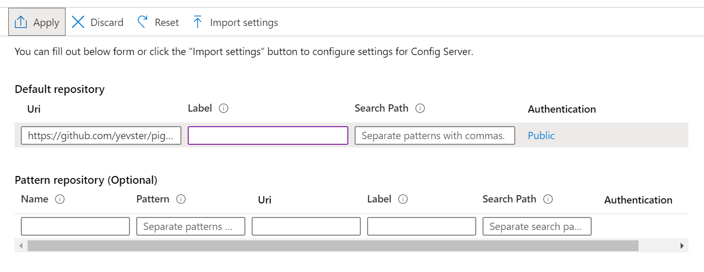

# Migrate a Spring Cloud App

In this section, we're going to take a pre-existing Spring Cloud application, consisting of four microservices, and migrate it to Azure Spring Cloud in its entirety.

We will use this migrated application in the subsequent section to demonstrate the monitoring, scaling, and tracing capabilities of Azure Spring Cloud.

## Creating an Azure Spring Cloud instance

In the previous section, we created an Azure Spring Cloud instance from the Azure Portal. Let's now do it via the Azure CLI

```bash
az spring-cloud create --name ${SPRING_CLOUD_SERVICE} \
    --resource-group ${RESOURCE_GROUP} \
    --location ${REGION}
```

Use the same values for `${RESOURCE_GROUP}` and `${REGION}` that you used when deploying the ARM template in Section 00. Be sure to use your username in the name of your Spring Cloud Service, so as to avoid name contention with other participants. __Azure Spring Cloud instance names must be globally unique.__

## Configure defaults in your development machine
You can set defaults so that you do not have to repeatedly mention resource group, location and service name in your subsequent calls to Azure Spring Cloud:

```bash
# Configure defaults
az configure --defaults \
    group=${RESOURCE_GROUP} \
    location=${REGION} \
    spring-cloud=${SPRING_CLOUD_SERVICE}
```

## Deploying the configuration server

In the previous section, you saw the configuration for a single microservice provided in an accompanying YAML file called `application.yml`. Spring Cloud simplifies configuration management by centralizing configuration in a single configuration server.

Azure Spring Cloud extends this functionality by provisioning and managing a Config Server directly from a git repository containing configuration.

- Go to the overview page of your Azure Spring Cloud server, and select "Config server" in the menu
- Configure the repository we previously created:
  - Add the repository URL. We host a public repository with the configuration for Piggy Metrics at `https://github.com/microsoft/piggymetrics-config.git`. However, a private repository can also be used by populating the Authentication credentials. For the purposes of this lab, let the Authentication type remain `Public`, and click "Apply":

  

- Click on "Apply" and wait for the operation to succeeed. Azure Spring Cloud will now create a configuration server to provide configuration to all microservices, with no further effort from you.

## Creating the apps

In the previous section, you provisioned an App, to host a single microservice, in the Azure Portal. We will now need to provision five apps: four for each of the microservices we plan to migrate, plus one for the gateway, which will host the UI and expose our microservices to the public. For expediency, we will perform these tasks from the Azure CLI:

```bash
# Create an app for the gateway + UI
az spring-cloud app create --name gateway --instance-count 1 --is-public true

# Create an app for each of the microservices
az spring-cloud app create --name account-service --instance-count 1
az spring-cloud app create --name auth-service --instance-count 1
az spring-cloud app create --name statistics-service --instance-count 1
az spring-cloud app create --name notification-service --instance-count 1
```

## Building the apps

```bash
cd piggymetrics
mvn package -DskipTests=true #Skip unit tests to save time. Naughty naughty!
```

## Create the service binding for CosmosDB

Just as we did in the previous section, let's inject the CosmosDB configuration into each of the apps we just created. For expediency, we will use Azure CLI to accomplish this task.

```bash
COSMOS_ACCOUNT_ID=$(az cosmosdb list --query '[].id' -o tsv)

az spring-cloud app binding cosmos add --api-type mongo --app account-service -n cosmos --resource-id "${COSMOS_ACCOUNT_ID}" --database-name account-db
az spring-cloud app binding cosmos add --api-type mongo --app auth-service -n cosmos --resource-id "${COSMOS_ACCOUNT_ID}" --database-name auth-db
az spring-cloud app binding cosmos add --api-type mongo --app notification-service -n cosmos --resource-id "${COSMOS_ACCOUNT_ID}" --database-name notification-db
az spring-cloud app binding cosmos add --api-type mongo --app statistics-service -n cosmos --resource-id "${COSMOS_ACCOUNT_ID}" --database-name statistics-db
```

## Deploying the apps

__We should move this to config in a private repo__

Navigate to the Resource Group created in step 00. Click on the RabbitMQ VM (`sclabq-<unique string>`), and assign the following variables with the information about the RabbitMQ server:

```bash
RABBITMQ_HOST
RABBITMQ_PORT
```

Set the following additional variables:

```bash
RABBITMQ_USERNAME=rmquser
RABBITMQ_PASSWORD=<password provided when deploying the ARM template>
```

Deploy the webapps using the `az spring cloud deploy` command.

```
# Deploy gateway app
az spring-cloud app deploy --name gateway \
    --jar-path gateway/target/gateway-1.0-SNAPSHOT.jar

# Deploy account-service app
az spring-cloud app deploy --name account-service \
    --jar-path account-service/target/account-service-1.0-SNAPSHOT.jar \
    --env RABBITMQ_HOST=${RABBITMQ_HOST} \
          RABBITMQ_PORT=${RABBITMQ_PORT} \
          RABBITMQ_USERNAME=${RABBITMQ_USERNAME} \
          RABBITMQ_PASSWORD=${RABBITMQ_PASSWORD}
          
# Deploy auth-service app
az spring-cloud app deploy --name auth-service \
    --jar-path auth-service/target/auth-service-1.0-SNAPSHOT.jar
          
# Deploy statistics-service app
az spring-cloud app deploy --name statistics-service \
    --jar-path statistics-service/target/statistics-service-1.0-SNAPSHOT.jar \
    --env RABBITMQ_HOST=${RABBITMQ_HOST} \
          RABBITMQ_PORT=${RABBITMQ_PORT} \
          RABBITMQ_USERNAME=${RABBITMQ_USERNAME} \
          RABBITMQ_PASSWORD=${RABBITMQ_PASSWORD}

# Deploy notification-service app
az spring-cloud app deploy --name notification-service \
    --jar-path notification-service/target/notification-service-1.0.0-SNAPSHOT.jar \
    --env RABBITMQ_HOST=${RABBITMQ_HOST} \
          RABBITMQ_PORT=${RABBITMQ_PORT} \
          RABBITMQ_USERNAME=${RABBITMQ_USERNAME} \
          RABBITMQ_PASSWORD=${RABBITMQ_PASSWORD}
```
