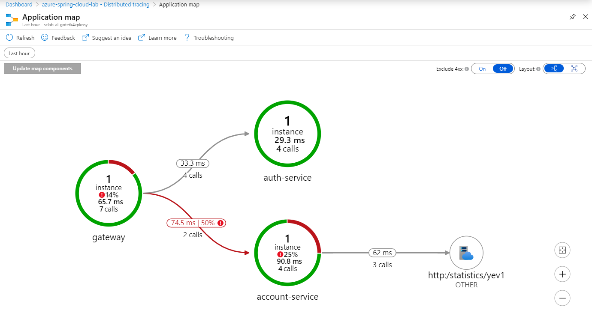
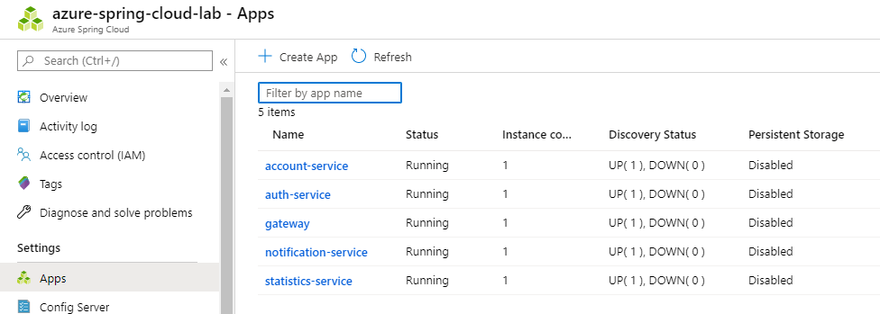

# Observability and Scaling

After all the migrations, deployment, and automated deployment pipelines, all our microservices are up and running. But suddenly, something starts misbehaving. Intermittent errors start appearing when some action is taken, but where are they caused? Let's investigate.

## View distributed trace

Shortly after creating the Azure Spring Cloud instance in Section 1, we enabled distributed tracing. Now, let's make use of it.

- Open the Azure Spring Cloud instance in Azure Portal.
- Under Monitoring, click on Distributed Tracing. Then, click on Application map.

You can now see a schematic of the interactions among the deployed microservices.

> 💡 It can take ~2 minutes for interactions with microservices to be recorded by App Insights and reflected in Distributed Tracing.

Clicking on a node, you can see a pane with a history of the slowest requests sent to that microservice:

You can click "Investigate Performance" for more detailed performance history from App Insights.

## Scaling Out

Suppose we have discovered, in viewing the distributed trace, that some requests to `auth-service` are taking over a minute to complete, and others are returning status code 408 (operation timed out).

A reasonable hypothesis might be that auth-service is overloaded and needs to be scaled out.

- Navigate to the Azure Spring Cloud instance in Azure Portal.
- Under Settings, select Apps. Note, the instance count for each of the microservices is currently 1.

Click on `auth-service` and, under Settings, click on "Scale".

Here, we can scale the microservice up by increasing its allotment of CPU and RAM. But because the function of `auth-service` isn't computationally intensive, let's instead increase the App Instance Count to 3.

Return to the "Apps" page under the Azure Spring Cloud Instance. You should now see the Instance count increased to 3. The status of the service may change to "Upgrading" once the new replicas come up, but should return to running, once all the instances are available.

---

⬅️ Previous section: [02 - Troubleshooting](../02-troubleshooting/README.md)

➡️ Next section: [04 - Enable Continuous Deployment](../04-enable-continuous-deployment/README.md)